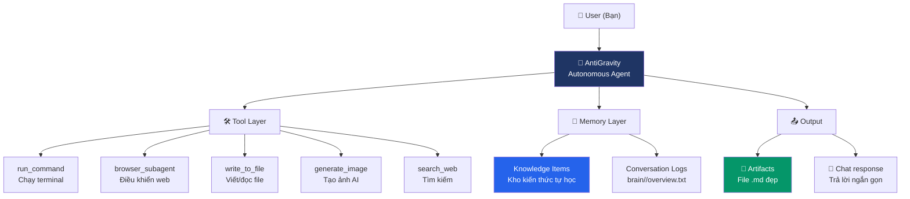

# 🎯 Demo Artifact — AntiGravity showcase

> [!NOTE]
> Đây là **Artifact** — file tài liệu được render đẹp thay vì text thô trong chat. Bạn có thể cuộn, click link, xem diagram ngay tại đây.

---

## 1. 📊 Bảng biểu (Table)

| Tính năng | Chat thông thường | AntiGravity Artifact |
|---|---|---|
| Bảng biểu | ❌ Text thô | ✅ Render đẹp, có màu |
| Sơ đồ | ❌ Không thể | ✅ Mermaid diagram |
| Trình chiếu | ❌ Không thể | ✅ Carousel slides |
| Ảnh AI | ❌ Không thể | ✅ Inline images |
| Link file | ❌ Paste đường dẫn | ✅ Clickable deep links |
| Persistent | ❌ Mất sau chat | ✅ Lưu file, dùng lại được |

---

## 2. 🗺️ Mermaid Diagram — Kiến trúc AntiGravity



---

## 3. 🎠 Carousel Slides — So sánh 3 công cụ

````carousel
### 🟢 Claude Code — Anthropic

**Bản chất:** Autonomous Agent chạy terminal

**Điểm mạnh:**
- Lập luận độc lập cực tốt (autonomous reasoning)
- Ít cần con người can thiệp giữa chừng
- Hỗ trợ MCP ecosystem lớn nhất (chính chủ Anthropic)

**Điểm yếu:**
- Memory thủ công — phải tự viết `CLAUDE.md`
- Output là text thô trên terminal

```
# Cách dùng
$ claude "Viết unit test cho module auth, chạy và sửa nếu lỗi"
```

<!-- slide -->
### 🔵 Gemini CLI — Google

**Bản chất:** Trợ lý CLI gọn nhẹ, focus scripting & API

**Điểm mạnh:**
- Nhanh gọn cho task đơn giản
- Tích hợp tốt với Google Cloud
- Đọc `GEMINI.md` theo từng folder

**Điểm yếu:**
- Không có long-term memory chuyên biệt
- MCP đang thử nghiệm (experimental)
- Chỉ lưu session ngắn

```
# Cách dùng
$ gemini "Tóm tắt file README này"
```

<!-- slide -->
### 🟣 AntiGravity — Google DeepMind

**Bản chất:** Autonomous Agent với Hybrid Interface

**Điểm mạnh:**
- ✅ Knowledge Items (KIs) — tự học từ phiên cũ
- ✅ Browser Subagent — điều khiển web, ghi video
- ✅ Artifacts — output đẹp như slide báo cáo
- ✅ Generate Image — tạo ảnh AI thay placeholder

**Điểm yếu:**
- Cần kết nối internet
- Phụ thuộc built-in model (không BYOK)

> 💡 Bạn đang dùng công cụ này ngay lúc này!
````

---

## 4. 💻 Code Diff — Trước/Sau chỉnh sửa

Ví dụ AntiGravity sửa một hàm Python và hiển thị diff:

```diff
 def calculate_revenue(sales_data):
-    total = 0
-    for item in sales_data:
-        total = total + item['price'] * item['qty']
-    return total
+    """Tính tổng doanh thu từ danh sách giao dịch."""
+    return sum(
+        item['price'] * item['qty']
+        for item in sales_data
+        if item.get('status') == 'completed'
+    )
```

> [!TIP]
> Xanh = thêm mới, Đỏ = xóa đi. AntiGravity luôn hiển thị diff để bạn kiểm tra trước khi apply.

---

## 5. 🔗 File Links — Click thẳng vào code

AntiGravity có thể tạo link click thẳng đến đúng dòng file, ví dụ:

- Xem file gốc: [ANTIGRAVITY_FIX_v2.docx](file:///d:/_AntiGravity/_playground/ANTIGRAVITY_FIX_v2.docx)
- Xem file markdown này: [demo_artifact.md](file:///C:/Users/nguye/.gemini/antigravity/brain/68af8114-632a-42d4-9dd5-52bcb077a368/artifacts/demo_artifact.md)

---

## 6. ⚠️ Alerts — Nhấn mạnh thông tin quan trọng

> [!IMPORTANT]
> Artifacts được lưu vào `<AppData>/.gemini/antigravity/brain/<conversation-id>/artifacts/` — persistent, không mất theo session.

> [!WARNING]
> Artifacts khác với chat response. Chat response ngắn gọn, Artifact chứa nội dung đầy đủ và có thể chia sẻ.

> [!CAUTION]
> Đừng nhầm Artifact với file `.md` thông thường — Artifact được AntiGravity **render trực tiếp** trong UI có syntax highlighting, diagram rendering, carousel...

---

## Tóm lại: Khi nào dùng Artifact?

| Tình huống | Chat response | Artifact |
|---|---|---|
| Hỏi nhanh 1-2 câu | ✅ | ❌ |
| Báo cáo phân tích | ❌ | ✅ |
| So sánh nhiều option | ❌ | ✅ |
| Tài liệu bàn giao team | ❌ | ✅ |
| Kết quả debug có diff | ❌ | ✅ |
| Architecture diagram | ❌ | ✅ |

